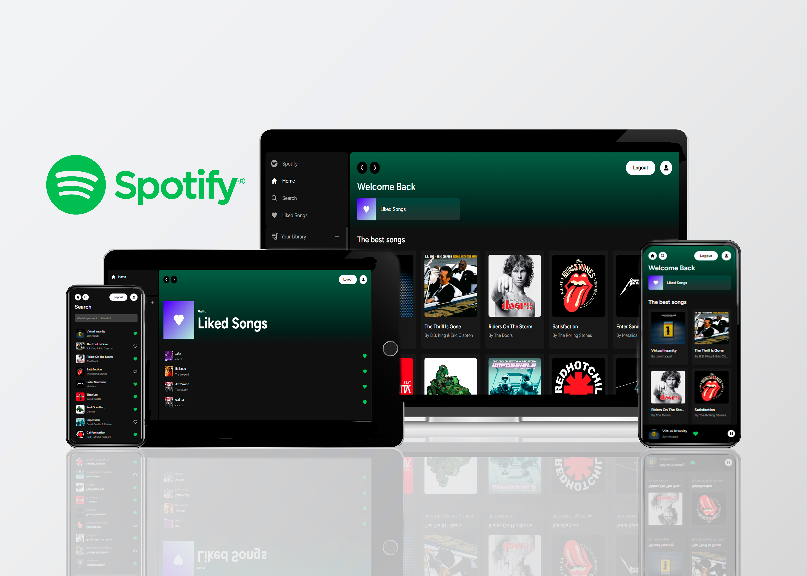
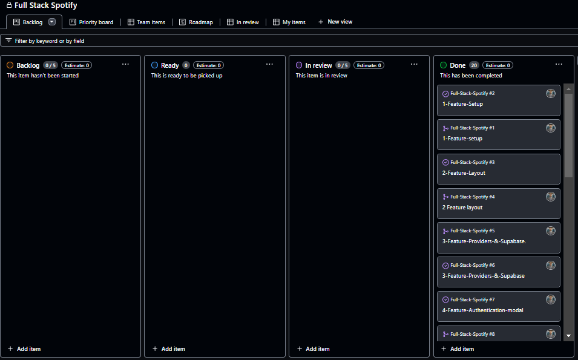
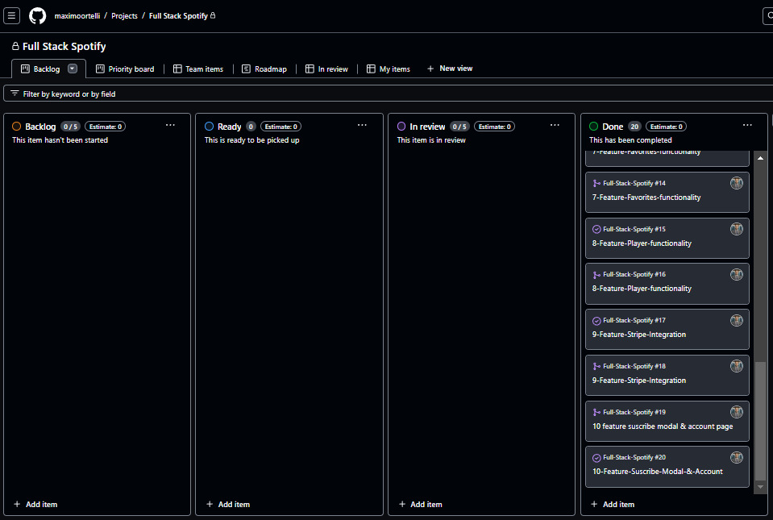

<a name="readme-top"></a>
<div align="center">
   <h1>🔊🎧 Full Stack Spotify 🎧🔊</h1>
</div>
  <div align="center">
    
  </div>

# 📗 Table of Contents

- [📗 Table of Contents](#-table-of-contents)
- [🔊🎧 Full Stack Spotify](#-full-stack-spotify)
- [✅ Deployment](#-deployment)
  - [🛠 Built With](#-built-with)
    - [Tech Stack](#tech-stack)
  - [💻 Getting Started](#-getting-started)
    - [Prerequisites](#prerequisites)
    - [Setup](#setup)
    - [Install](#install)
    - [💾 Database](#-database)
    - [Usage](#usage)
    - [Run tests](#run-tests)
  - [📊 Kanban Board](#-kanban-board)
  - [👥 Authors](#-authors)
  - [🔭 Future Features](#-future-features)
  - [🤝 Contributing](#-contributing)
  - [⭐️ Show your support](#️-show-your-support)
  - [🙏 Acknowledgments](#-acknowledgments)
  - [📝 License](#-license)

# 🔊🎧 Full Stack Spotify <a name="full-stack-spotify"></a>

> In this new project I have made a site to reserve or rent houses or apartments identical to Airbnb, taking advantage of key technologies such as JavaScript, TypeScript, React, Node Next.js, NextAuth, Tailwind.css, MongoDB and Express.

# 💻✅ Deployment 

<a name="deployment"></a>

[CLICK HERE TO SEE THE DEPLOYMENT](https://full-stack-spotify-zeta.vercel.app/)

# 🛠 Built With 

<a name="built-with"></a>

# Tech Stack 

<a name="tech-stack"></a>

<div>
     <h2>Client side</h2>
     <ul>   
     <li>
        
        <a href="https://reactjs.org">React.js</a>
     </li>
     <li>
        
        <a href="https://developer.mozilla.org/en-US/docs/Web/JavaScript">JavaScript</a>
     </li>
     <li>
        
        <a href="https://www.typescriptlang.org/">TypeScript</a>
     </li>
      <li>
       
       <a href="https://eslint.org">Eslint</a>
     </li>
      <li>
        
        <a href="https://tailwindcss.com">Tailwind CSS</a>
     </li>
      <li>
       
       <a href="https://nodejs.org/en">NodeJS</a>
     </li>
</div>

<div>
       <h2>Server side</h2>
  <ul>
       <li>
          
          <a href="https://nextjs.org/">Next.js</a>
       </li>
  </ul>
</div>

<div>
    <h2>Database</h2>
    <ul>
     <li>
         
         <a href="https://www.postgresql.org/">PostgreSQL</a>
     </li>
     <li>
         
         <a href="https://supabase.com/">Supabase</a>
     </li>
    </ul>
</div>


## Getting Started

First, run the development server:

```bash
npm run dev
# or
yarn dev
# or
pnpm dev
# or
bun dev
```

Open [http://localhost:3000](http://localhost:3000) with your browser to see the result.

You can start editing the page by modifying `app/page.tsx`. The page auto-updates as you edit the file.

This project uses [`next/font`](https://nextjs.org/docs/basic-features/font-optimization) to automatically optimize and load Inter, a custom Google Font.

## Learn More

To learn more about Next.js, take a look at the following resources:

- [Next.js Documentation](https://nextjs.org/docs) - learn about Next.js features and API.
- [Learn Next.js](https://nextjs.org/learn) - an interactive Next.js tutorial.

You can check out [the Next.js GitHub repository](https://github.com/vercel/next.js/) - your feedback and contributions are welcome!

## Deploy on Vercel

The easiest way to deploy your Next.js app is to use the [Vercel Platform](https://vercel.com/new?utm_medium=default-template&filter=next.js&utm_source=create-next-app&utm_campaign=create-next-app-readme) from the creators of Next.js.

Check out our [Next.js deployment documentation](https://nextjs.org/docs/deployment) for more details.

# Kanban board <a name="kanban-board"></a>
 - [Kanban board Project link](https://github.com/users/maximoortelli/projects/15)

# Complete State of Kanban board
  
  
  

# 👥 Authors 
<a name="author"></a>

👤 **Maximo Ortelli**

- 💻GitHub: [@Maximo Ortelli](https://github.com/maximoortelli)
- 💻LinkedIn: [Maximo Ortelli](https://www.linkedin.com/in/maximo-ortelli-rueda/)

# 🔭 Future Features 
<a name="future-features"></a>

- [x] Tailwind design
- [x] Tailwind animations and effects
- [x] Full responsiveness
- [x] Credential authentication
- [x] Google authentication
- [x] Github authentication
- [x] Image upload using Cloudinary CDN
- [x] Client form validation and handling using react-hook-form
- [x] Server error handling using react-toast
- [x] Calendars with react-date-range
- [x] Page loading state
- [x] Page empty state
- [x] Booking / Reservation system
- [x] Guest reservation cancellation
- [x] Owner reservation cancellation
- [x] Creation and deletion of properties
- [x] Pricing calculation
- [x] Advanced search algorithm by category, date range, map location, number of guests, rooms and bathrooms
    - For example we will filter out properties that have a reservation in your desired date range to travel
- [x] Favorites system
- [x] Shareable URL filters
    - Lets say you select a category, location and date range, you will be able to share URL with a logged out friend in another browser and they will see the same results
- [x] How to write POST and DELETE routes in route handlers (app/api)
- [x] How to fetch data in server react components by directly accessing database (WITHOUT API! like Magic!)
- [x] How to handle files like error.tsx and loading.tsx which are new Next 13 templating files to unify loading and error handling
- [x] How to handle relations between Server and Child components!

<p align="right">(<a href="#readme-top">back to top</a>)</p>

# 🤝 Contributing <a name="contributing"></a>

Contributions, issues, and feature requests are welcome!

Feel free to check the [issues page](https://github.com/maximoortelli/Full-Stack-Spotify/issues).

<p align="right">(<a href="#readme-top">back to top</a>)</p>

# ⭐️ Show your support <a name="support"></a>

If you like this project please give it a star 😁🌟✨

<p align="right">(<a href="#readme-top">back to top</a>)</p>

# 🙏 Acknowledgments <a name="acknowledgements"></a>

We thank to [Spotify](https://open.spotify.com/intl-es) for the design.

<p align="right">(<a href="#readme-top">back to top</a>)</p>

# 📝 License <a name="license"></a>

This project is [MIT](./LICENSE) licensed.

<p align="right">(<a href="#readme-top">back to top</a>)</p>
